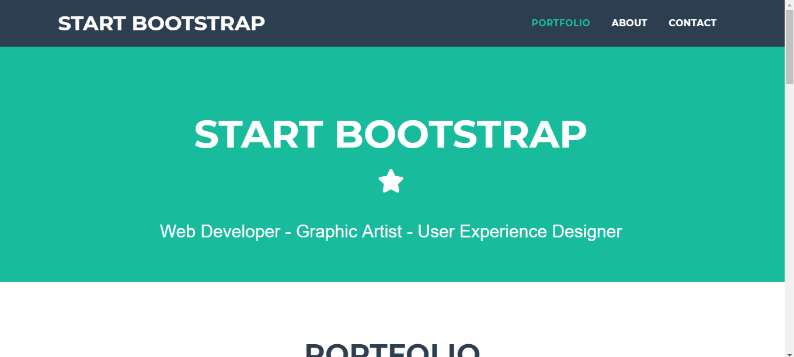
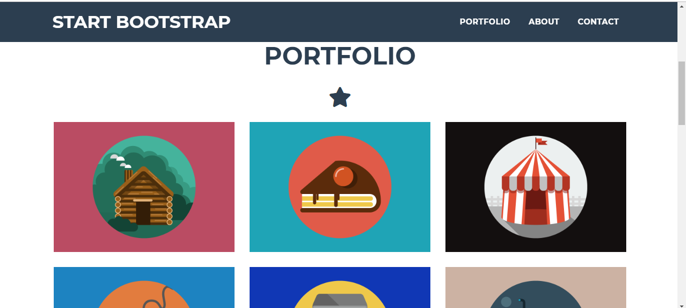
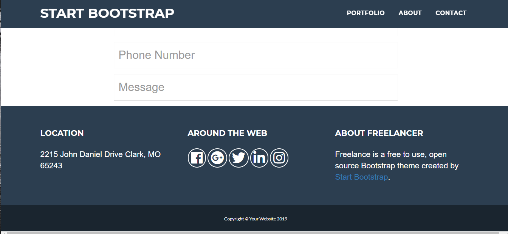

<h1> ##StartUpBootstrap</h1>

In questo progetto l'obiettivo era la creazione di una pagina web graficamente uguale a quella del sito web StartUpBootstrapp proprio con l'utilizzo dello stesso Bootstrap.
Per la produzione sono state utilizzate le tecnologie HTML, CSS.
<h4> Screenshot </h4>

 

 

 

